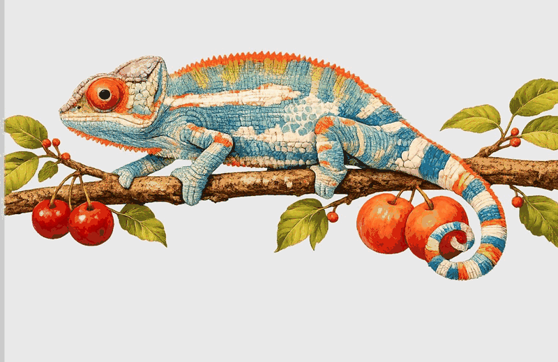

<!-- Ocean Blue Header -->
<div align="center">


<!-- Typing SVG -->
[](https://git.io/typing-svg)

<!-- Status Badges -->


<br>



*`> Like a chameleon — I adapt to every stack, every challenge, every vibe.`*

</div>

---

## 📡 `> connect`

<div align="center">

[](https://x.com/3h0ll7)
[](https://github.com/3h0ll7)
[](https://hassanaii.lovable.app)

</div>

---

## 📊 `> github stats`

<div align="center">
  
  
</div>

<br>

<div align="center">
  
</div>

<br>

<!-- GitHub Activity Graph -->
<div align="center">
  
</div>

---

## 🚀 `> featured repos`

<div align="center">

<a href="https://github.com/3h0ll7/digitalnurse"></a>
<a href="https://github.com/3h0ll7/insightmed"></a>
<a href="https://github.com/3h0ll7/kidinnuaitools"></a>
<a href="https://github.com/3h0ll7/scriptforge-ai"></a>
<a href="https://github.com/3h0ll7/itemvalue"></a>
<a href="https://github.com/3h0ll7/hassanaii"></a>

</div>

---

## 🏗️ `> product domains`

<table align="center">
<tr>
<td align="center" width="25%">

### 🤖 AI Tools & SaaS
**kidinnuaitools**<br>
191+ curated AI directory<br>
10 professional categories

**scriptforge-ai**<br>
Video script generator<br>
EN/AR · YouTube/TikTok

**AnimalVerse AI**<br>
Ecosystem simulation<br>
Claude API agents

</td>
<td align="center" width="25%">

### 🇮🇶 Iraqi Market
**itemvalue / شكد تسوه**<br>
AI used-item pricing<br>
Iraqi Dinar · PayTabs

**Real Estate Dashboard**<br>
Najaf property market<br>
Peace & Quiet Index

</td>
<td align="center" width="25%">

### 🏥 Med-AI
**digitalnurse**<br>
Clinical cockpit · PWA<br>
90+ commits

**insightmed**<br>
Medical doc analysis<br>
Multi-model AI council

</td>
<td align="center" width="25%">

### 🎨 Vibe Builds
**hassanaii**<br>
Personal portfolio<br>
AI & Tech brand

**ICU BRAIN**<br>
Multi-agent dashboard<br>
7 specialized agents

</td>
</tr>
</table>

---

## 🛠️ `> tech stack`

<div align="center">

### Languages


### Frontend


### Backend & Database


### AI & Models


### Vibe Coding Stack


</div>

---

## 📈 `> metrics`

<div align="center">

| Metric | Value |
|:------:|:-----:|
| 🏗️ **Total Repositories** | `16` |
| ⭐ **Stars Given** | `42` |
| 🔀 **Pull Shark** | `x2` |
| ⚡ **Quickdraw** | `Achieved` |
| 🎯 **YOLO** | `Achieved` |
| 🤖 **AI Experience** | `4 Years` |
| 🎨 **Vibe Coding** | `Ship fast · break nothing` |
| 🌐 **Languages** | `English · Arabic (Iraqi)` |
| 📜 **Certification** | `Claude Architect (studying)` |

</div>

---

## 🎯 `> current focus`

```
┌──────────────────────────────────────────────────────────────┐
│                                                              │
│  [■■■■■■■■░░] 80%  digitalnurse     → Production PWA        │
│  [■■■■■■░░░░] 60%  ICU BRAIN        → Multi-agent system    │
│  [■■■■■░░░░░] 50%  Claude Architect → Certification exam    │
│  [■■■■░░░░░░] 40%  itemvalue        → Iraqi market launch   │
│  [■■■░░░░░░░] 30%  Real Estate      → Najaf dashboard       │
│                                                              │
└──────────────────────────────────────────────────────────────┘
```

---

## 🐍 `> contribution snake`

<div align="center">

<picture>
  <source media="(prefers-color-scheme: dark)" srcset="https://raw.githubusercontent.com/3h0ll7/3h0ll7/output/github-snake-dark.svg" />
  <source media="(prefers-color-scheme: light)" srcset="https://raw.githubusercontent.com/3h0ll7/3h0ll7/output/github-snake.svg" />
  
</picture>

</div>

---

## 👁️ `> visitor count`

<div align="center">


<br>

```
 ╔══════════════════════════════════════════════════════════╗
 ║                                                          ║
 ║   "I don't write code. I vibe it into existence."        ║
 ║                                                          ║
 ║    — @3h0ll7                                             ║
 ║      Najaf, Iraq 🇮🇶                                      ║
 ║                                                          ║
 ╚══════════════════════════════════════════════════════════╝
```


</div>
